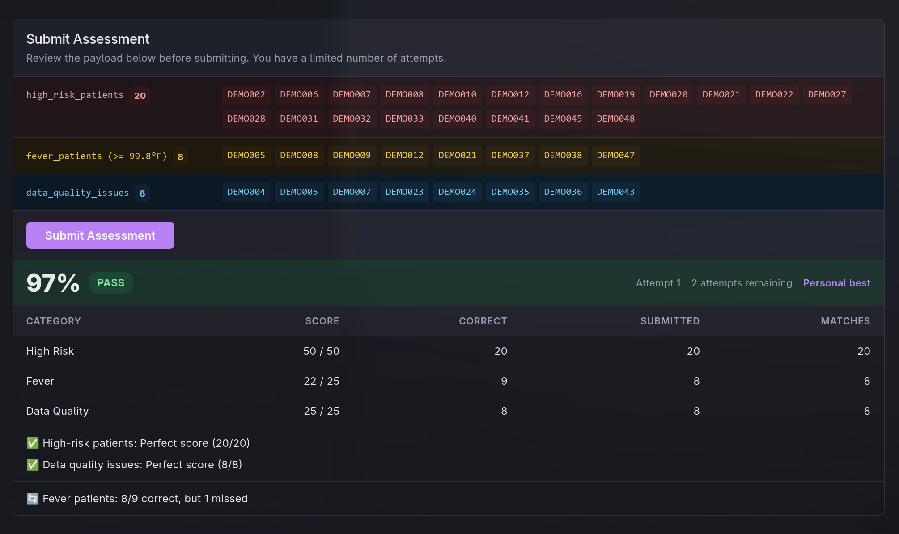
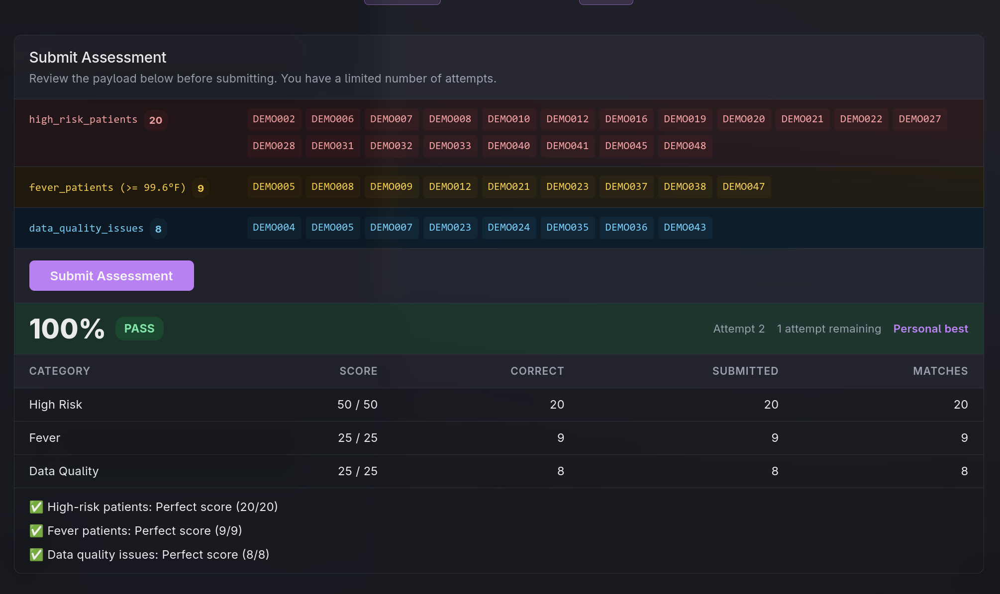

# Patient Risk Scoring System

A take-home assessment project built with React, TypeScript, and Vite. The application fetches patient data from a paginated REST API, calculates risk scores across three clinical categories, identifies patients of concern, and submits the results to a graded assessment endpoint.

## Assessment Results

### Attempt 1: 97%


High Risk and Data Quality were perfect (20/20 and 8/8 respectively), but one fever patient was missed — DEMO023 with a temperature of 99.7°F. This was a simple error where the fever threshold in the submission payload was mistakenly set to 99.8°F instead of the correct 99.6°F, causing any patient with a temperature between 99.6°F and 99.7°F to be excluded. The fix was a one-line change in the scoring logic.

### Attempt 2: 100%


Perfect score across all three categories after correcting the fever threshold.

---

## Features

- Fetches all patient records sequentially across paginated API pages, with per-page rate-limit retry and exponential backoff
- Calculates a risk score per patient across three categories: blood pressure, temperature, and age
- Identifies high-risk patients, fever patients, and records with data quality issues
- Client-side pagination — all pages are loaded once and cached for 5 minutes; navigating the table makes no additional API calls
- Submission panel with a full payload preview before posting, and a structured results display after

## Risk Scoring

Total risk score = BP score + Temperature score + Age score

**Blood Pressure**
| Category | Criteria | Points |
|---|---|---|
| Normal | Systolic < 120 AND Diastolic < 80 | 0 |
| Elevated | Systolic 120–129 AND Diastolic < 80 | 1 |
| Stage 1 | Systolic 130–139 OR Diastolic 80–89 | 2 |
| Stage 2 | Systolic ≥ 140 OR Diastolic ≥ 90 | 3 |

If systolic and diastolic fall into different categories, the higher score is used. Missing or non-numeric values score 0 and are flagged as data quality issues.

**Temperature**
| Category | Criteria | Points |
|---|---|---|
| Normal | ≤ 99.5°F | 0 |
| Low Fever | 99.6–100.9°F | 1 |
| High Fever | ≥ 101.0°F | 2 |

**Age**
| Category | Criteria | Points |
|---|---|---|
| Under 40 | < 40 years | 0 |
| Middle | 40–65 years | 1 |
| Over 65 | > 65 years | 2 |

## Alert Lists

- **High Risk:** patients with a total risk score ≥ 4
- **Fever:** patients with a valid temperature ≥ 99.6°F
- **Data Quality Issues:** patients with missing or malformed BP, temperature, or age values

## Project Structure

```
src/
  api/
    patients.ts       # Fetch + normalization for paginated patient data; fetchAllPatients
    submit.ts         # POST to assessment submission endpoint
  components/
    AlertsPanel.tsx         # High-risk / fever / data quality alert cards
    PatientTable.tsx        # Paginated table with per-row risk badges
    SubmissionPanel.tsx     # Payload preview and submission with result breakdown
    index.tsx               # Component barrel export
  hooks/
    useAllPatients.ts         # Fetches all pages sequentially, 5-min cache
    usePatients.ts            # Single-page patient fetching hook
    usePatientRiskAnalysis.ts # Derives scores + alerts from the shared cache
    useSubmitAssessment.ts    # TanStack Query mutation for assessment submission
    index.ts                  # Hook barrel export
  lib/
    scoring.ts      # Pure risk scoring functions and alert/payload computation
    queryConfig.ts  # Shared retry + backoff config for API queries
  App.tsx
  main.tsx
```

## Tech Stack

- [React 19](https://react.dev)
- [TypeScript](https://www.typescriptlang.org)
- [Vite](https://vite.dev)
- [TanStack Query v5](https://tanstack.com/query/latest)

## Setup

1. Install dependencies:
   ```bash
   bun install
   ```

2. Set environment variables in `.env`:
   ```
   VITE_BASE_URL=https://your-api-base-url.com
   VITE_API_KEY=your_api_key_here
   ```

3. Start the dev server:
   ```bash
   bun run dev
   ```
